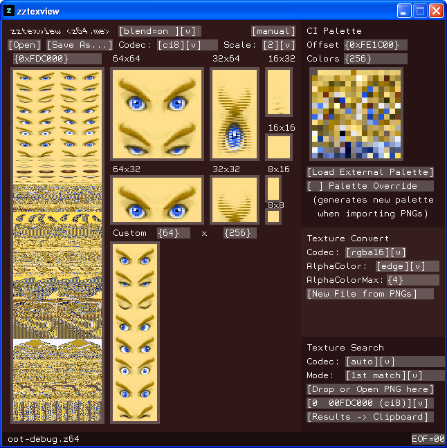

# zztexview

`zztexview` is a program for viewing, converting, and locating texture data in Nintendo 64 rom images and files dumped from them. Much inspiration was taken from [Texture64](https://github.com/queueRAM/Texture64).



## Features
 - Texture search locates pixel data matching a user-provided PNG file (even color-indexed formats are supported)
 - Export/import feature makes it easy to update existing textures
 - Create new texture banks from one or more PNGs, including the ability to share palettes
 - External palettes
 - Palette editing
 - Entirely self-contained with no external dependencies like the .NET Framework or Mono
 - Windows XP

## Supported Image Formats
 - rgba8888 (32 bit)
 - rgba5551 (16 bit)
 - intensity-alpha (16 bit)
 - intensity-alpha (8 bit)
 - intensity-alpha (4 bit)
 - intensity (8 bit)
 - intensity (4 bit)
 - color-indexed (8 bit)
 - color-indexed (4 bit)

## Quick Tips
 - First, click the `Open` button, or drag-and-drop a binary file onto the `left pane`.
 - Left-click any preview to bring up the `Import/Export PNG` dialog.
 - Right-click-drag in any preview window to scroll quickly.
 - Using the mouse wheel inside a preview window nudges it along one pixel at a time: perfect for making fine adjustments.
 - In a value box, you can right-click-drag up/down to rapidly change it, or use the mouse wheel for smaller increments.
 - Scroll the mouse wheel on any drop-down menu to quickly navigate through its items without having to click.

## Revision History
* v1.0.2
   * Better `edge` results with `i` (intensity) formats
   * In exported images, alpha channel is user's selected 'blending' mode
   * `zztexview` is now open source
* v1.0.1
   * Bug fix: could not edit value/text boxes after clicking drop-downs
   * Bug fix: "Scale" drop-down text now wraps properly when scrolling on it
   * Bug report credits: [AriaHiro64](https://github.com/AriaHiro64), [Zeldaboy14](https://github.com/Zeldaboy14)
* v1.0.0
   * Initial release

## Manual
```
SYNOPSIS

      zztexview is a program for viewing, converting, and locating
   texture data in Nintendo 64 rom images and files dumped from them.
   Much inspiration was taken from Texture64.


LOADING FILES

      To open a file for exploring, either click the 'Open' button
   or the left sidebar, or try dropping a file onto one of them.


NAVIGATION

      While you can edit the value boxes manually by clicking them, you
   will find the easiest way to navigate is by doing a right-click-drag
   inside any preview window. You do this by placing your cursor inside
   a preview, pressing and holding the right mouse button, then moving
   the cursor up or down. You can also do this inside a value box to
   quickly adjust its value up or down, or even navigate this manual.
   
      Scrolling with the mouse wheel can also be used to adjust value
   box values, or quickly change a drop-down menu's selection without
   having to click it. Mouse wheel scrolling inside a preview area will
   nudge you forward or back a single pixel at a time.


HOW CODECS WORK

      Each codec describes a valid format/bit combination. For example,
   ci8 refers to a texture of the format ci (color indexed), where each
   pixel is eight (8) bits. Higher bit values provide more detail, but
   cost more space. A brief description of each format follows.
   
      rgba     contains a separate color/alpha value for every pixel
      
      ci       a series of index values, which are used to look up
               what color each pixel should be according to a palette
               (the palette offset is independent from the texture
               offset; multiple textures can use the same palette)
      
      ia       packed value list describing intensity (grayscale)
               and alpha (opacity) for every pixel
      
      i        every pixel contains a single value that is shared
               by all color channels: RGBA (whiter = more opaque)


CI PALETTE

      The 'CI Palette' pane contains a palette data preview. You can
   adjust the number of colors within it for safer editing, if you
   happen to know how many colors the one you're editing contains.
   All the same navigation rules described above apply here.
   
      If for some reason you must load a palette from a separate file,
   you can do so by clicking or dropping a file onto the 'Load External
   Palette' button.
   
      Otherwise, it will source palette data from whatever file is
   already loaded, since storing textures and palettes in the same
   file is a common practice.
   
      'Palette Override' and what role palettes play when importing
   textures are both explained in the next section.


CHANGING TEXTURES & PALETTES

      You can click any preview (palette or texture) to open the image
   action dialog. Click 'Export PNG' inside this dialog and follow the
   prompt. Edit this file in your external editor of choice.
   
      To import the modified PNG, click the same preview as before, and
   select 'Import PNG'. You will be asked to select the PNG you wish to
   import. Note that if you are importing over a CI format texture, the
   colors will be matched to the palette shown in the 'CI Palette' pane
   as closely as possible. If you want a new palette to be generated
   instead, enable the 'Palette Override' option before conversion. Be
   mindful that the old palette will be overwritten if you do this,
   which will break all other textures that use it if it is shared.
   
      If you are making major changes to a CI texture (aka, using a new
   palette), it is recommended that you modify the palette before you
   import the new texture. Also be aware that a palette can be shared
   by multiple textures, so be prepared to import updated versions of
   all textures that rely on any palette you update.
   
      As a final note, any texture imported this way will use the
   'AlphaColor' generation settings that have been selected within the
   'Texture Convert' pane, described below.


TEXTURE CONVERT

      First and foremost: the 'Texture Convert' pane is not for
   importing textures and palettes into the currently opened file.
   It is for creating a brand new file containing only textures. If
   changing textures in an existing file is what you're looking for,
   read the section above this one. That said, only a small niche has
   use for either of these features.

      This pane allows you to convert one or more PNGs to a valid
   codec. Simply click or drop PNGs onto the 'New File from PNGs'
   button. You can hold the 'Ctrl' key on your keyboard when clicking
   files to select multiple. If everything goes well, you should get a
   preview of the results, and be able to copy notes to your clipboard
   if you wish. To actually save the generated file somewhere, click
   the 'Save As' button in the upper corner of the window.
   
      When multiple PNGs are specified and the codec is a CI format,
   they are all optimized to use a shared palette, instead of one
   palette being derived for each.
   
   AlphaColor
   
         Older converters have a track record of mishandling textures
      containing transparency, such that you will notice white or black
      outlines along the edges of your textures in-game. This is because
      they are setting the colors of invisible pixels to white or black.
      The 'AlphaColor' menu offers algorithms that are meant to address
      this problem. Each is briefly described below:
         
         edge     derives alpha colors by expanding visible edge colors
         
         average  the alpha color used across the texture
                  is the average of all its visible colors
         
         white    every invisible pixel's color is set to white
         
         black    every invisible pixel's color is set to black
         
         image    use invisible pixel colors that are stored in the PNG
                * NOTE: if the number of unique invisible colors exeeds
                        the value of AlphaColorMax, it falls back to
                        the 'edge' algorithm
   
   AlphaColorMax
   
         This is the maximum number of unique alpha colors to allow
      in the generated palette (applies to CI formats only).


TEXTURE SEARCH

      Use the 'Texture Search' pane to search the loaded file for any
   texture data that matches the PNG you provide. This is useful for
   locating rom offsets of textures dumped by video plugins.
   
      If an external palette has been loaded loaded, that will be
   searched for palette data instead of the primary file.
   
      When matches are found, they are displayed immediately. Use the
   'Results' drop-down to browse the results. A result containing 'P'
   (for example, 'ci8-P') indicates a partial match. Partial matches
   happen only for CI formats, and occur when matching CI data was
   located, but no palette could be found. You can copy the results
   to your clipboard by clicking the 'Results -> Clipboard' button.
   
   Two additional codecs are introduced here:
   
      auto    search only for codecs that are most likely to match
              the provided PNG (this has proved to be extremely
              accurate throughout my rigorous testing)
      
      all     search every codec (this is slower and only recommended
              for textures that 'auto' fails to find matches for)
   
      * The other codecs in this drop-down force it to search for the
        one codec you specify. This is most useful if you already
        know the codec of the texture you're trying to find.
   
   Mode
   
      1st match   searches only up until it finds a match, then stops
      
      find all    this is slower, but if you want to locate multiple
                  occurrences of the same texture, use this


FAQ

  Q: What is this blend feature?
  A: It allows you to see the colors of invisible pixels. The blending
     mode you have selected also controls how a texture appears when
     exported to PNG.

  Q: What is the EOF toggle in the corner for?
  A: Files are padded at the end, which can sometimes be misleading.
     For this reason, I found it helpful to offer the option of
     customizing what value is used for padding the loaded file.


                                <z64.me>
```

